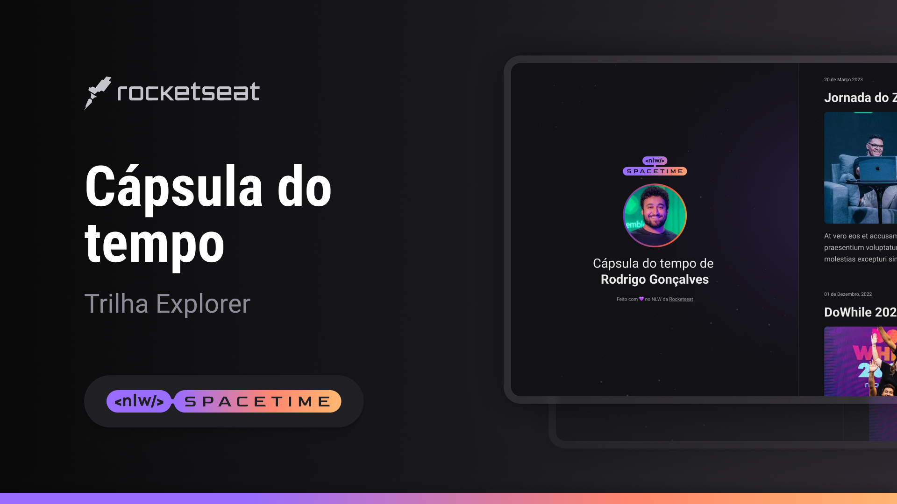

<h1 align="center"> Cápsula do tempo </h1>

Projeto de página web, promovido pela Rocketseat para ensino de tecnologias WEB.  

## 💻 Projeto 
Esse é um projeto Web Responsivo de uma cápsula do tempo para exibir memórias em uma linha do tempo.

- [Acesse o projeto finalizado, online](https://andreskull2.github.io/nlw-spacetime/)

- [Assistir aulas](https://www.rocketseat.com.br/formacao/fullstack)

## 🚀 Tecnologias
Esse projeto foi desenvolvido durante o NLW da Rocketseat com as seguintes tecnologias:

- HTML
- CSS
- Git e Github
- Figma

## 🏷️ Layout
Você pode visualizar o layout do projeto através
[desse link](https://www.figma.com/file/6cQTcYRDB9lwrQHUkA9rdj/C%C3%A1psula-do-tempo-%E2%80%A2-Trilha-Explorer-(Community)-(Minha)?type=design&node-id=352%3A8&t=CP5ySMJ4FtD45aA4-1)
É necessário ter uma conta no [Figma](https://www.figma.com)

---

Feito com ♥ by Rocketseat :wave: [Participe da nossa comunidade!](https://discord.gg/rocketseat)
